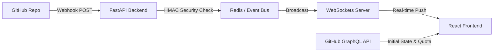

# GitPulse: Real-Time GitHub Activity Monitor


> GitPulse is a high-performance, event-driven dashboard that monitors GitHub repository activity in real-time. Designed as a lightweight, zero-refresh monitoring tool, it bridges secure Webhook processing with WebSocket live updates and highly optimized client-side persistence.

## Sneak Peek
*(Add a GIF here showing a commit happening in the terminal and instantly appearing on the web UI without refreshing)*

## System Architecture
The application bridges standard request-response fetching with real-time event pushing:



## Core Features
* **Live Pulse Feed:** Instant UI updates via Socket.io when events (commits, pushes) occur on tracked repositories.
* **Smart Dashboard:** Fetches repository metadata via **Apollo GraphQL**, featuring client-side filtering to prevent unnecessary network requests.
* **Resilient UX:** Custom Skeleton loaders to prevent Cumulative Layout Shift (CLS), global Error Boundaries, and automated connection health-checks for the WebSocket.
* **Secure Auth:** GitHub PAT authentication with secure `localStorage` persistence and automatic header injection.

## Key Challenges & Architectural Solutions

### 1. Zero-Latency Persistence & Data Privacy
**The Problem:** Storing real-time push events in a traditional centralized database introduces network latency on initial load and raises privacy concerns.
**The Solution:** I architected a Client-Side Persistence model using localStorage. The frontend acts as the single source of truth. I implemented a lazy-evaluation cleanup routine that strictly enforces a 30-day data retention policy, automatically purging stale events during state initialization. This ensures sub-millisecond initial paints.

### 2. Webhook Security & Payload Integrity
**The Problem:** Exposing a public `/api/webhook` endpoint means anyone could `POST` malicious or fake data, compromising the dashboard's integrity.
**The Solution:** Implemented a strict verification middleware on the backend. GitHub signs its payloads using a secret token. The server computes a `SHA256 HMAC` hash of the incoming request body and compares it against the `X-Hub-Signature-256` header. If they don't match, the request is immediately dropped with a `401 Unauthorized`.

### 3. Frontend Bundle Bloat & TTI Optimization
**The Problem:** Integrating heavy libraries like `Recharts` and `@apollo/client` bloated the initial Vite build to over 1.1MB, negatively impacting the Time-to-Interactive (TTI) on slower networks.
**The Solution:** Implemented a custom `manualChunks` strategy in the Rollup configuration. By splitting framework code, heavy utilities, and charting libraries into separate vendor chunks, the critical `index.js` entry point was reduced to **~39KB (a 96% reduction)**. This ensures near-instant initial paints and maximizes long-term browser caching.

### 4. Distributed Cloud Infraestructure & WSS Handshakes
**The Problem:** Hosting on Vercel (Front) and Render (Back) created complex CORS blocks and connection timeouts during HTTP polling.
**The Solution:** Configured environment-specific CORS policies and forced the client to upgrade directly to the WebSocket transport protocol (`wss://`). This bypasses the polling phase, eliminating cold-start connection drops common in distributed environments.

### 4. State Management & Memory Leaks in Real-Time
**The Problem:** High-activity repositories could flood the frontend with hundreds of WebSocket events per minute, eventually causing browser memory leaks and DOM sluggishness.
**The Solution:** The event queue is strictly capped at 50 items. Furthermore, the Socket.io listeners are wrapped in a robust `useEffect` hook that guarantees clean disconnection and listener removal when components unmount, preventing overlapping ghost subscriptions.

### 5. Data Transformation for DataViz
**The Problem:** Raw event data is non-continuous; days with zero activity are missing, which distorts visual timelines in charts.
**The Solution:** Developed pure utility functions (fully covered by **Vitest**) that map event timestamps to a continuous rolling 7/30-day calendar array, dynamically injecting `count: 0` for empty days to maintain structural integrity in the chart.

## Tech Stack
* **Frontend:** React 19, Vite 7, Tailwind CSS v4, Recharts.
* **State & Data:** Apollo Client (GraphQL), Socket.io-client, Custom Hooks.
* **Backend:** FastAPI (Python), WebSockets, Uvicorn, HMAC Security.
* **Testing & Quality:** Vitest, ESLint, Prettier.

## 🚀 Local Setup

This project uses a `Makefile` to automate the development environment.

### Prerequisites
* **Python 3.10+** & **Node.js 18+**
* **Make** (installed by default on macOS/Linux)

### 1. Initial Installation
Run this command to set up virtual environments and install all dependencies:
```bash
make setup
```

### 2. Environment Configuration
Create a `.env` file in the `backend/` and `frontend/` directories. You will need a `GITHUB_WEBHOOK_SECRET`.

### 3. Running the App
Start both the FastAPI backend and the Vite frontend simultaneously with interleaved logs:
```bash
make dev
```
* Backend: `http://localhost:8000`
* Frontend: `http://localhost:5173`

### 4. Utility Commands
* `make gen-ts`: Regenerates the TypeScript client from OpenAPI schemas.
* `make help`: View all available automation commands.